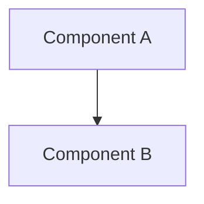
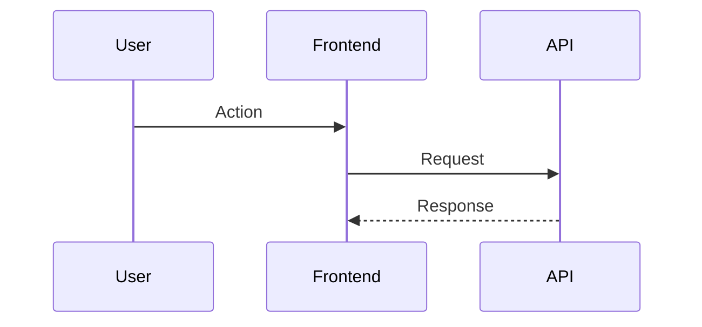
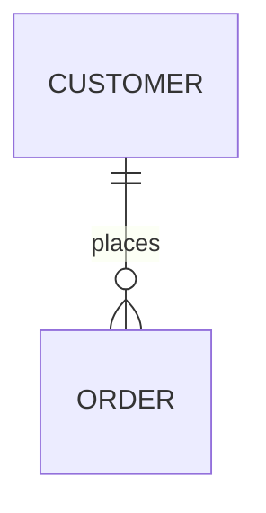

# Technical Design

Generate a comprehensive technical design for feature: **$ARGUMENTS**

## Interactive Approval: Requirements Review

**CRITICAL**: Design can only be generated after the agent confirms that the user has reviewed and approved the requirements.

### Requirements Review Process (Instructions for the Agent)
1.  **Check for `requirements.md`**: Verify that the file `.kiro/specs/$ARGUMENTS/requirements.md` exists.
2.  **Prompt for user review**: Ask the user the following question exactly: "`requirements.md`をレビューしましたか？ [y/N]"
3.  **Handle user response**:
    *   **If 'y' (yes)**: Proceed with the rest of this command's tasks. First, update the `.kiro/specs/$ARGUMENTS/spec.json` file to mark requirements as approved.
    *   **If 'N' (no)**: Stop execution and instruct the user to review `requirements.md` before running this command again.

**JSON update for `spec.json` on approval**:
```json
{
  "approvals": {
    "requirements": {
      "generated": true,
      "approved": true
    }
  },
  "phase": "requirements-approved"
}
```

## Context Analysis

### Requirements Foundation
**CRITICAL**: The design must be built upon the approved requirements document.

The agent must read and fully understand:
-   The requirements document: `.kiro/specs/$ARGUMENTS/requirements.md`

### Steering Context
The agent should read the following steering documents if they exist:
-   `.kiro/steering/structure.md`
-   `.kiro/steering/tech.md`
-   `.kiro/steering/product.md`

## Task: Create Technical Design

**Prerequisite Verified**: Requirements are approved.

### 1. Research & Investigation Process
**MANDATORY**: The agent must conduct research using the `google_web_search` tool.

1.  **Technology Research**: Use web searches to find current best practices for the technology stack (as defined in `tech.md` or the requirements), including security considerations and performance benchmarks.
2.  **Context Building**: Summarize key findings from the research that will inform design decisions.

### 2. Design Document Generation
Generate a comprehensive design document. The agent should check the `language` field in `spec.json` and write the document in that language. The document should incorporate findings from the research step.

**The agent must generate a complete `design.md` file with the following structure:**

```markdown
# Technical Design

## 1. Overview
[Technical overview of the implementation approach, referencing key requirements.]

## 2. Architecture
[High-level system architecture and technology decisions, informed by research.]



### Technology Stack Rationale
[Justify the technology choices based on research findings and project requirements.]

## 3. Data Flow
[Describe how data flows through the system. Include sequence diagrams for key user flows.]



## 4. Components and Interfaces
[A breakdown of backend services, frontend components, and API endpoints.]

### API Endpoints
| Method | Route                 | Purpose         |
|--------|-----------------------|-----------------|
| GET    | /api/[resource]       | List resources  |
| POST   | /api/[resource]       | Create resource |

## 5. Data Models
[Data model definitions, ER diagrams, and database schema.]



## 6. Security Considerations
[Address authentication, authorization, and data protection based on research.]

## 7. Testing Strategy
[Outline the strategy for unit, integration, and end-to-end testing.]
```

### 3. Update Metadata
After writing the design document, update `.kiro/specs/$ARGUMENTS/spec.json` with the following changes:
```json
{
  "phase": "design-generated",
  "approvals": {
    "design": {
      "generated": true,
      "approved": false
    }
  },
  "updated_at": "current_timestamp"
}
```

---

## INTERACTIVE APPROVAL (Agent's Internal Note)

The next command, `kiro spec-tasks`, will require a similar interactive approval for this design file.

## Instructions for the Agent

1.  **Confirm User Approval**: Start by asking the user for approval of the `requirements.md` file. Do not proceed without a 'y' response.
2.  **Update `spec.json`**: Upon approval, first read, then update the `spec.json` file to reflect that requirements are approved.
3.  **Read Context**: Read the approved `requirements.md` and the relevant steering documents.
4.  **Conduct Research**: Use `google_web_search` to research best practices for the required technologies.
5.  **Generate Design**: Write a comprehensive `design.md` file following the structure specified above. Use mermaid diagrams.
6.  **Write to File**: Save the content to `.kiro/specs/$ARGUMENTS/design.md`.
7.  **Update Metadata Again**: Read and update `spec.json` again to set the phase to `design-generated`.
8.  **Inform User**: Tell the user that the design has been generated and that they should review it before proceeding to the next step (`kiro spec-tasks $ARGUMENTS`).
