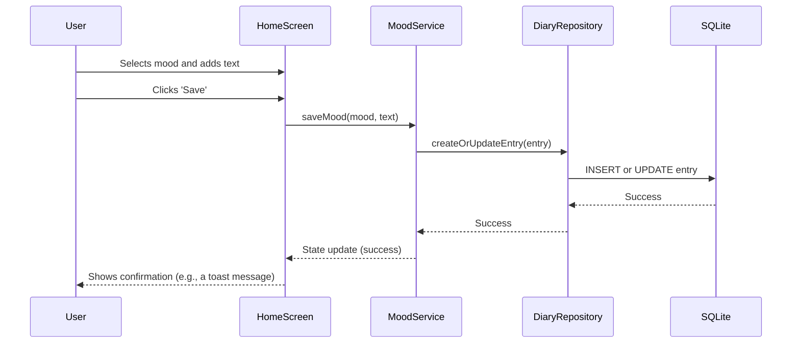

# Technical Design: Mood Diary App

## 1. Overview
This document outlines the technical design for a simple, cross-platform mood diary application. The design is based on the approved requirements and aims for a clean, maintainable, and scalable architecture using Flutter.

## 2. Architecture
The application will follow a standard client-server architecture. However, for this initial version, the "server" will be a local SQLite database on the user's device to ensure simplicity and offline capability.

```mermaid
graph TD
    subgraph "Flutter Application"
        A[UI Layer (Widgets)] --> B[State Management (Riverpod)]
        B --> C[Business Logic (Services)]
        C --> D[Data Layer (Repositories)]
        D --> E[Local Database (SQLite)]
    end
```

### Technology Stack Rationale
-   **Framework**: **Flutter**. Chosen for its rapid development cycle (Hot Reload), expressive UI capabilities, and excellent performance. It allows for a single codebase for both iOS and Android, which is ideal for a simple application.
-   **Language**: **Dart**. The required language for Flutter.
-   **State Management**: **Riverpod**. A robust and scalable state management library for Flutter that provides compile-time safety and easy dependency injection.
-   **Local Database**: **SQLite** via the `sqflite` package. A reliable and standard choice for on-device storage, perfect for a diary application.
-   **Routing**: **GoRouter**. A declarative routing package that simplifies navigation and handles deep linking.

## 3. Data Flow

### User records a new mood


## 4. Components and Interfaces

### Key Directory Structure
```
lib/
|-- main.dart
|-- features/
|   |-- mood_tracker/
|   |   |-- data/
|   |   |   |-- diary_repository.dart
|   |   |   |-- models/
|   |   |   |   |-- diary_entry.dart
|   |   |-- domain/
|   |   |   |-- diary_service.dart
|   |   |-- presentation/
|   |   |   |-- screens/
|   |   |   |   |-- home_screen.dart
|   |   |   |   |-- calendar_screen.dart
|   |   |   |-- widgets/
|   |   |   |   |-- mood_selector.dart
|-- core/
|   |-- database/
|   |   |-- database_helper.dart
|   |-- routing/
|   |   |-- app_router.dart
```

### API (Service Layer Interfaces)
```dart
// lib/features/mood_tracker/domain/diary_service.dart
abstract class DiaryService {
  Future<void> saveEntry(DiaryEntry entry);
  Future<DiaryEntry?> getEntry(DateTime date);
  Future<List<DiaryEntry>> getEntriesForMonth(int year, int month);
}
```

## 5. Data Models

### `DiaryEntry` Model
```dart
// lib/features/mood_tracker/data/models/diary_entry.dart
enum Mood { awesome, good, okay, bad, terrible }

class DiaryEntry {
  final DateTime date;
  final Mood mood;
  final String? text;

  DiaryEntry({required this.date, required this.mood, this.text});
}
```

### Database Schema
A single table `diary_entries` will be used.

| Column | Type    | Constraints     |
|--------|---------|-----------------|
| date   | TEXT    | PRIMARY KEY     |
| mood   | TEXT    | NOT NULL        |
| text   | TEXT    | NULL            |

## 6. Security Considerations
-   **Local Data**: All data is stored locally on the user's device. No network requests mean no data is transmitted, significantly reducing security risks.
-   **Dependencies**: Only well-vetted and popular packages from `pub.dev` will be used.

## 7. Testing Strategy
-   **Unit Tests**: Business logic in `DiaryService` and data transformations in the repository will be unit tested.
-   **Widget Tests**: Key UI components like `MoodSelector` and screens will be tested using Flutter's widget testing framework.
-   **Integration Tests**: The flow of saving and retrieving data from the SQLite database will be tested.

---
**STATUS**: Design Generated
**NEXT STEP**: Review this file, then run `kiro spec-tasks mood-diary-app` to proceed.
